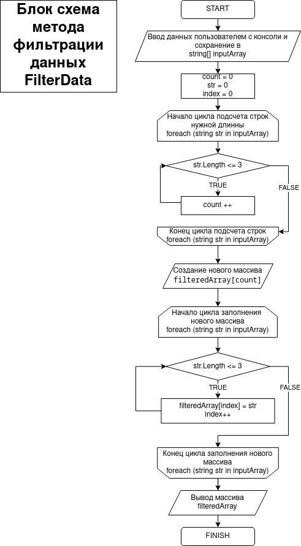

Итоговая контрольная работа по основному блоку

Задача алгоритмически не самая сложная, однако для полноценного выполнения проверочной работы необходимо:

1. Создать репозиторий на GitHub
2. Нарисовать блок-схему алгоритма (можно обойтись блок-схемой основной содержательной части, если вы выделяете её в отдельный метод)
3. Снабдить репозиторий оформленным текстовым описанием решения (файл README.md)
4. Написать программу, решающую поставленную задачу
5. Использовать контроль версий в работе над этим небольшим проектом (не должно быть так, что всё залито одним коммитом, 
как минимум этапы 2, 3, и 4 должны быть расположены в разных коммитах)

Задача: Написать программу, которая из имеющегося массива строк формирует новый массив из строк, длина которых меньше,
либо равна 3 символам. Первоначальный массив можно ввести с клавиатуры, либо задать на старте выполнения алгоритма. 
При решении не рекомендуется пользоваться коллекциями, лучше обойтись исключительно массивами.

Примеры:
[“Hello”, “2”, “world”, “:-)”] → [“2”, “:-)”]
[“1234”, “1567”, “-2”, “computer science”] → [“-2”]
[“Russia”, “Denmark”, “Kazan”] → []

Описание работы приложения:
После запуска приложения пользователю предлагается ввести с консоли элементы массив строк через запятую и пробел.
Посе ввода идет подсчет срок длиной равной не больше 3х символов.
Затем происходит вывод на экран отфильтрованного массива.

Решение:

1. Создаю репозиторий на GitHub с именем FinalWork1stBlock.git

2. Блок-схема алгоритма:

3. Файл README.md в процессе редактирования.

4. Программа написана, код лежит в папке project/project.cs.

5. Контроль версий исользован в проекте, смотри git log.